# 南方科技大学学生工作部智慧校园项目

北京希嘉创智教育科技有限公司

## 功能总览
- 预警首页
- 失联预警
- 考勤预警
- 宿舍预警
- 网络时长预警（已停用）
- 校长综合页

## 预警首页

### 综合预警

#### 仪表盘
- 仪表盘呈现综合预警反馈率、综合预警指数
- 鼠标悬停综合预警旁“？”呈现反馈率及综合预警指数计算方式

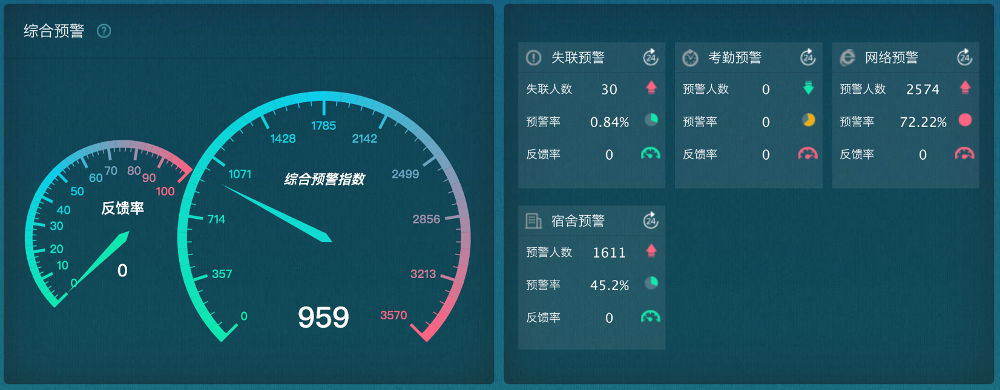

#### 综合预警概览
- 按照预警模块分别呈现各类预警预警人数、预警率及反馈率
- 鼠标悬停预警名称展示预警规则


### 综合预警指数和反馈率
- 支持切换过去7天和过去30天两个时间维度查看图表

#### 图像
- 以柱状图表示各学院综合预警指数数值，左方纵轴代表综合预警指数，横轴代表书院
- 以折线图表示各学院反馈率数值，右方纵轴代表反馈率，横轴代表书院
- 红色水平线代表各学院综合预警指数平均值
- 蓝色水平线代表各学院反馈率平均值
- 鼠标悬停柱状图、折线图、水平线会显示对应数值
- 点击图像上方综合预警指数方块隐藏各学院综合预警指数数值
- 点击图像上方反馈率隐藏各学院反馈率数值

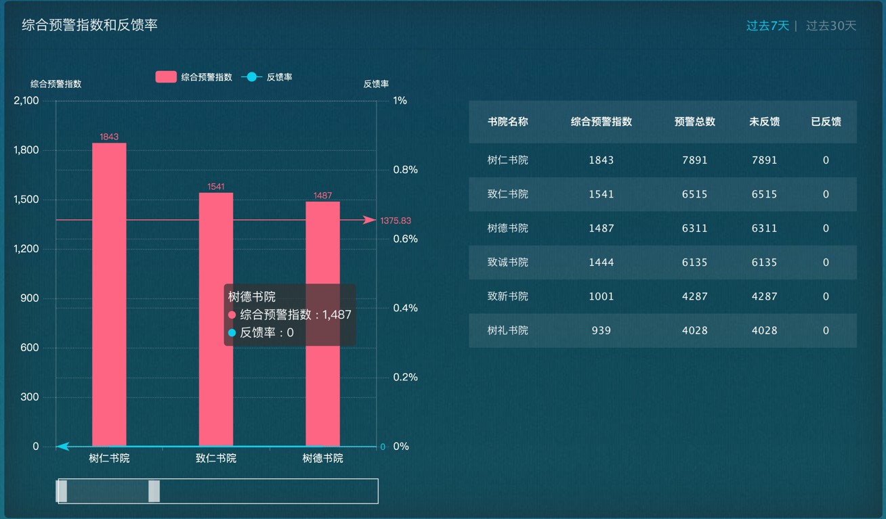

#### 表格
- 表格匹配左方图像数据，呈现书院名称、对应预警指数、预警总数、未反馈数量、已反馈数量
- 支持对列表以书院、院系、年级三个维度筛选，点击确定完成筛选
- 列表呈现学号、姓名、书院、学院、年级、班级、辅导员、待处理预警个数、详情处理信息
- 点击详情及处理列中操作项，呈现待处理预警详情，待处理预警详情展示学生姓名及学号，下方罗列各类预警名称、预警时间、预警状态及操作按钮
- 点击操作按钮进入对应预警列表进行反馈处理
- 支持选择呈现页数、设置每页展示条数、自定义设置转至所选页面，设置对应页数后点击“go”跳转到所选页面

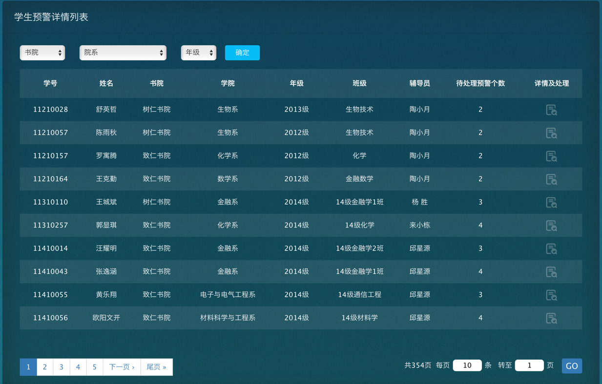


## 失联预警

### 安全报告

#### 安全报告
- 以饼图呈现预警及反馈情况，圆饼图呈现已预警和未预警数量及对应总数占比，外环图呈现已反馈数量和未反馈数量及对应总量占比
- 以方块标签形式呈现今日新增预警人数、今日解除预警人数、重点学生预警数、当前学生预警数
- 鼠标悬停各名称前“？”显示各名称定义

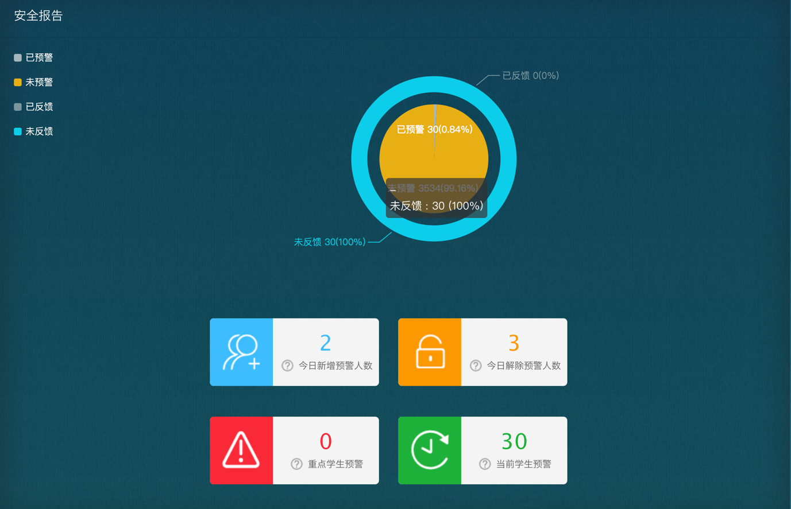

#### 安全态势
- 以柱状图形式呈现近九天新增失联预警人数及解除预警人数
- 鼠标悬停柱状图呈现新增人数、恢复人数及不变人数
- 点击上方黄色新增预警方块不展示新增预警数据，点击上方蓝色恢复人数方块不展示恢复人数数据

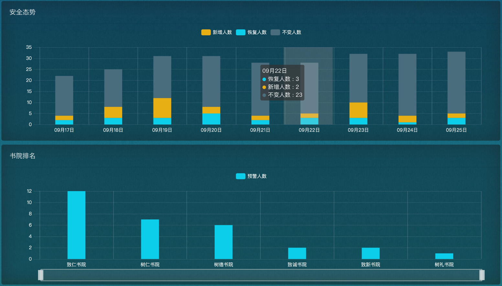

#### 辅导员排名
- 以柱状图展示辅导员所负责学生失联预警人数，自左至右由高到低依次排列
- 鼠标悬停每一柱状图呈现对应辅导员所负责学生失联预警人数
- 拖动下方滑轨可查看更多学院

### 预警监测

#### 失联监测
- 书院失联监测页面呈现重点学生、预警学生、今日新增、今日解除、辅导员总数、全部学生概况数据

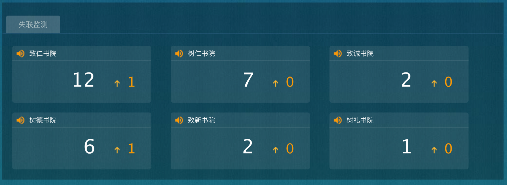

- 下方呈现学院各辅导员头像、姓名及负责学生总数和负责学生预警数

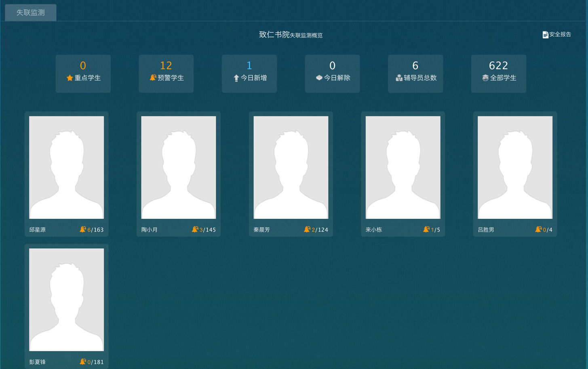

- 点击辅导员头像进入辅导员失联监测页面
- 辅导员失联监测页面呈现重点学生、预警学生、全部学生概况数据
- 下方tab页分别展示预警学生头像及预警学生列表
- 预警学生头像呈现学生姓名及头像信息，点击头像进入学生画像页面
- 预警学生列表呈现学生姓名、学号、书院、学院、专业、班级、失联天数及预警天数，点击姓名进入学生画像页面
- 点击下载图标支持对预警列表下载

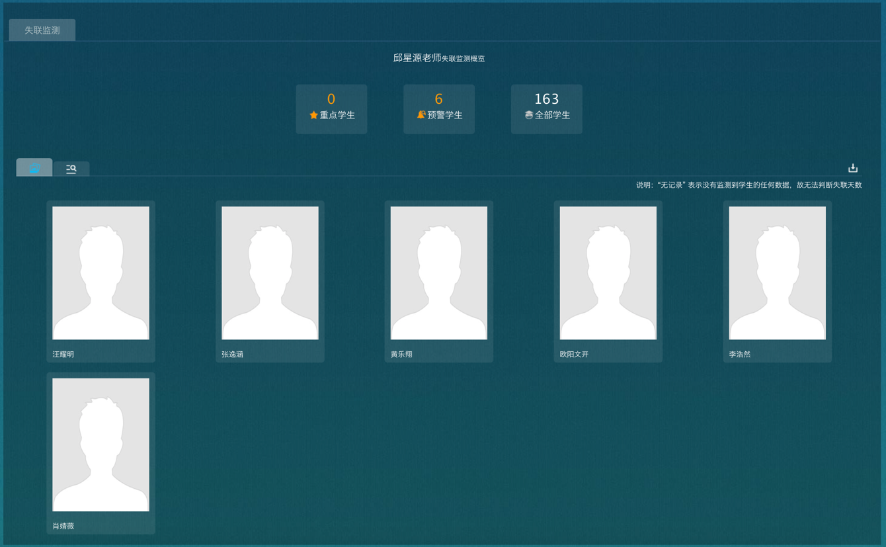

### 待办事件

- 支持tab选择全部／已反馈／未反馈三个维度事件筛选

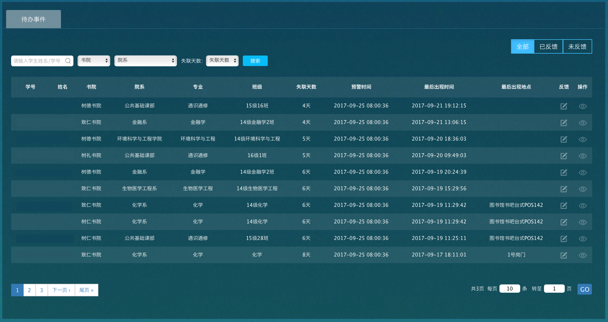

- 支持输入学生姓名／学号搜索对应学生事件，同时支持对书院、院系、失联天数三个维度筛选，点击搜索完成筛选

- 下方列表呈现学号、姓名、书院、院系、专业、班级、失联天数、预警时间、最后出现时间、最后出现地点、反馈情况、操作信息
- 点击操作列中操作选项可对事件进行反馈操作，点击查看对事件详情查看


### 历史预警

- 支持对自定义时间范围内筛选，选定时间范围后点击查询完成查询
- 下方列表呈现失联日期、当日新增、当日解除、当日预警总数
- 点击当日新增、当日解除、当日预警总数列中非零数字可查看数据明细

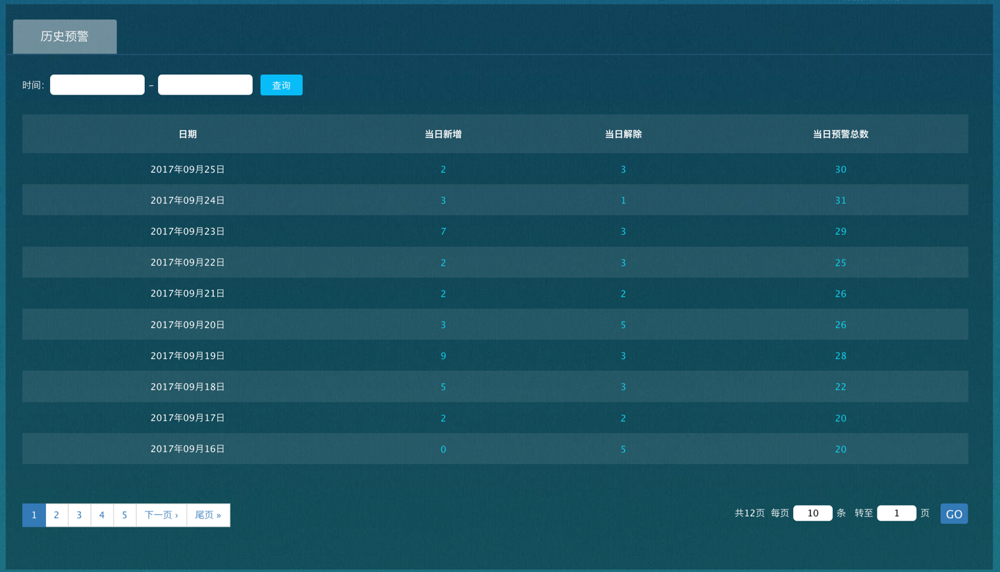

- 明细中以tab页呈现人员头像及人员列表，人员头像支持按照书院筛选，呈现人员头像及姓名，点击头像可进入学生画像页面
- 人员列表亦支持按照书院进行筛选，列表呈现学号、姓名、年级、书院、院系、专业、反馈信息，点击姓名进入学生画像页面
- 点击反馈详情列中查看按钮，可查看当前反馈状态
- 支持选择呈现页数、设置每页展示条数、自定义设置转至所选页面，设置对应页数后点击“go”跳转到所选页面

## 考勤预警

### 预警报告

#### 日历图
- 以日历图形式呈现每日考勤预警数量，并以学校学周方式排列
- 上方选择日期支持下拉筛选年份、月份
- 点击日历中具体日期左侧呈现对应日期的预期信息及当日的预警列表

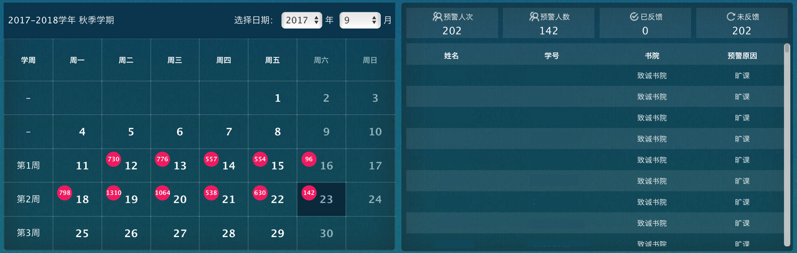

#### 预警概览
- 上方以标签形式呈现预警人次、预警人数、已反馈及未反馈概览数据
- 下方列表呈现当日考勤预警名单，包括姓名、学号、书院、预警原因
- 右侧预警概览信息与左侧日历选中天数同步对应
- 鼠标悬停至列表上支持上下活动查看更多预警人员信息

#### 时间范围选择
- 支持对近24小时、7天、30天、自定义时间维度选择，选择自定义选项左侧呈现时间范围选择框，点击确认后下方预警类型占比与选择的时间维度保持一致

#### 预警类型占比
- 以饼图形式呈现迟到、早退、旷课三类考勤预警占比及对应类型人数
- 分别点击左侧旷课、迟到、早退颜色方框，则点选后对应考勤类型占比及人数将不在饼图中展示

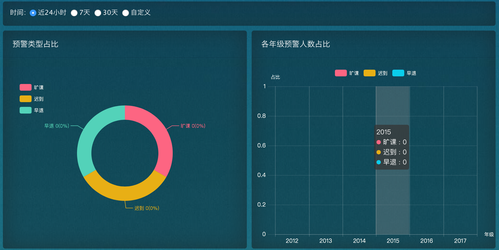

#### 各年级预警人数占比
- 以柱状图形式呈现各年级预警人数占比年级总人数，红橙蓝分别代表旷课、迟到、早退三类预警
- 点击三类预警代表的颜色方块将不在柱状图中呈现该类型预警数据
- 鼠标悬停对应年级柱状图，将展示旷课、迟到、早退三类预警的人数占比

#### 近7天缺勤率变化趋势
- 以折线图形式呈现近七天缺勤率变化趋势
- 鼠标悬停坐标点，将呈现对应日期的缺勤率
- 右侧以饼图呈现最高、最低缺勤率及对应日期

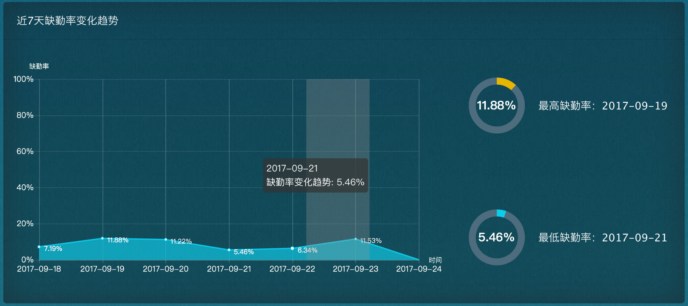

### 预警人员列表
#### 预警列表
- 支持按照反馈维度全部、已反馈、未反馈三类查看预警列表
- 支持输入学生姓名／学号点击查询搜索呈现对应学生考勤预警信息
- 支持下拉筛选院系、书院、年级、预警原因，支持选择预警时间范围获取对应条件预警人员信息
- 支持对预警列表全选、单选，支持批量确认，预警名单导出
- 预警人员列表呈现学号、姓名、书院、学院、年级、辅导员、预警原因、课程名称、课程节次、距处理完结倒计时、操作信息
- 学号列点击学号旁展开按钮呈现该学生历史考勤预警信息
- 操作列点击查看详情进入查看详情弹窗
- 考勤预警详情呈现学生基本信息（包括学生姓名、性别、学号、民族、书院、班级、专业、辅导员、年级、手机号）、预警信息（缺课类型、缺课课程、预警时间、课程节次、任课教师）、处理反馈信息（反馈老师、确认状态、处理详情）
- 确认状态支持下拉选择原因，处理详情手动输入处理说明点击保存完成操作
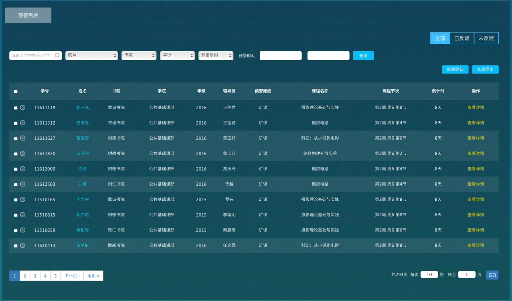

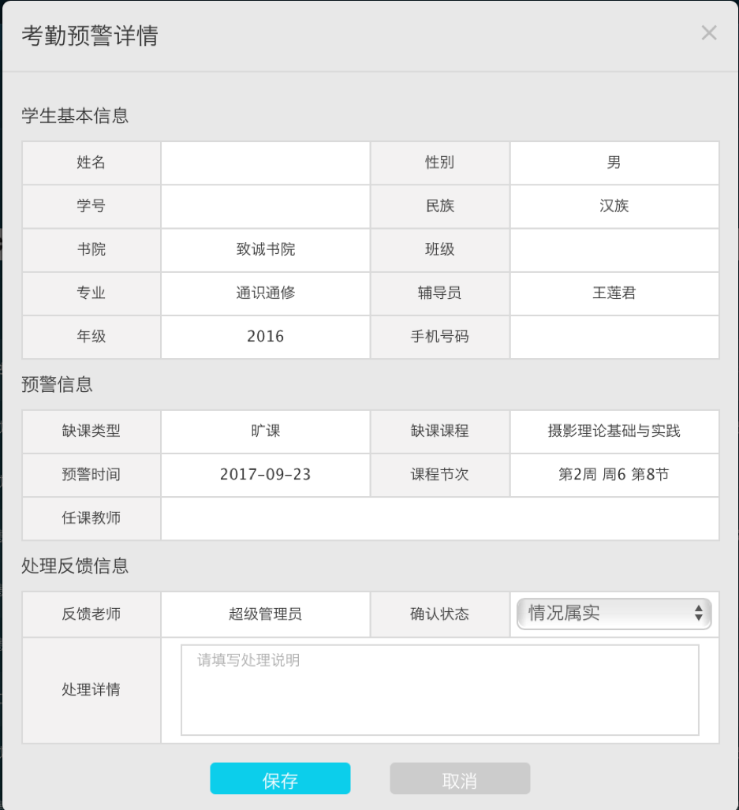

## 网络时长预警
### 预警报告
#### 日历图
以日历图形式呈现每日网络预警数量，并以学校学周方式排列
上方选择日期支持下拉筛选年份、月份
点击日历中具体日期左侧呈现对应日期的预期信息及当日的预警列表

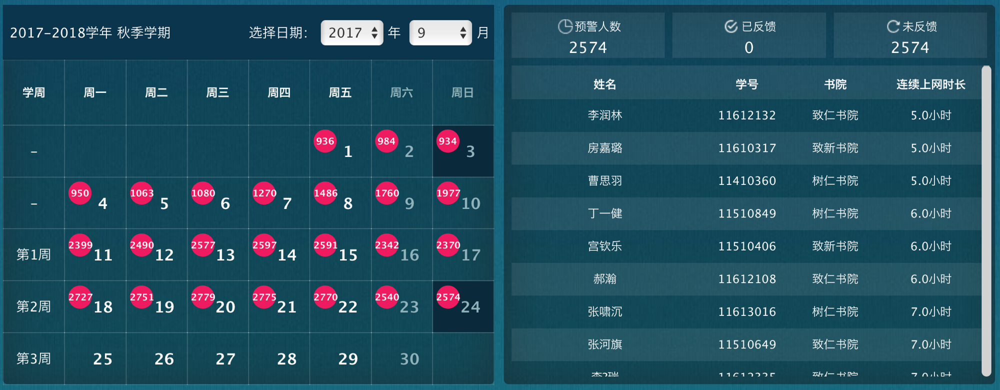

#### 预警概览
上方以标签形式呈现预警人数、已反馈及未反馈概览数据
下方列表呈现当日网络预警名单，包括姓名、学号、书院、连续上网时长
右侧预警概览信息与左侧日历选中天数同步对应
鼠标悬停至列表上支持上下活动查看更多预警人员信息

#### 时间范围选择
- 支持对近24小时、7天、30天、自定义时间维度选择，选择自定义选项左侧呈现时间范围选择框，点击确认后下方预警模块与选择的时间维度保持一致

#### 上网时长人数分布
- 以环状饼图形式呈现各时间段内上网时长分布人数及占比总人数
- 红橙绿蓝分别代表>8小时、4-8小时、2-4小时、<2小时四个时间段，分别点击对应颜色方块则在饼图中不展示对应时间段数据
- 支持tab切换学生群体与预警群体，学生群体指全部时间的上网分布，预警群体指已经网络预警的学生上网时间段分布

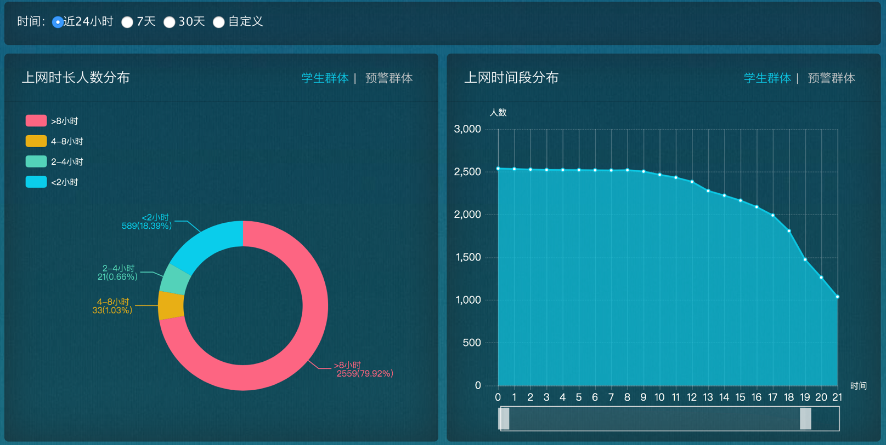

#### 上网时间段分布
- 以折线图形式呈现每段上网时长的人数分布，鼠标悬停每一坐标点呈现对应时间段内的上网人数
- 下方滑动滑轨可查看更多时间段内上网人数情况
- 支持tab切换学生群体与预警群体，学生群体指全部时间的上网分布，预警群体指已经网络预警的学生上网时间段分布

#### 上网学生年级分布
- 以柱状图形式呈现各年级上网人数及男女各自人数，蓝色代表男生，红色代表女生
- 单击男女生颜色方块图中对应不展示其数据
- 支持tab切换学生群体与预警群体，学生群体指全部时间的上网分布，预警群体指已经网络预警的学生上网时间段分布

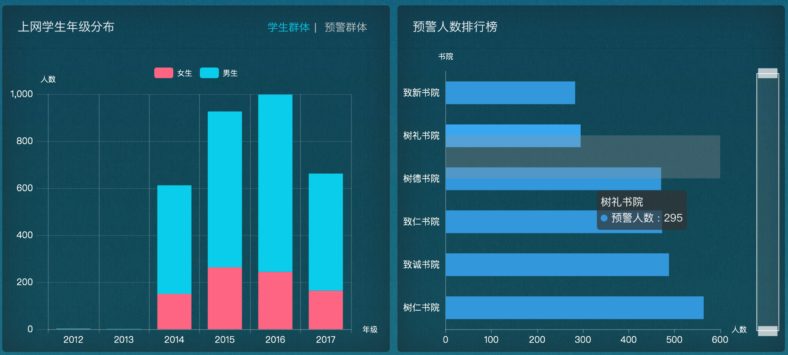

#### 预警人数排行榜
- 以横柱状图形式呈现各书院预警人数由低到高排行

### 预警人员列表
#### 预警列表
- 支持按照反馈维度全部、已反馈、未反馈三类查看预警列表
- 支持输入学生姓名／学号点击查询搜索呈现对应学生网络预警信息
- 支持下拉筛选院系、书院、年级，支持选择预警时间范围获取对应条件预警人员信息
- 支持对预警列表全选、单选，支持批量确认，预警名单导出
- 预警人员列表呈现学号、姓名、书院、学院、年级、辅导员、上网时长、最后下线时间、预警来源、操作信息
- 学号列点击学号旁展开按钮呈现该学生历史网络预警信息
- 操作列点击查看详情进入查看详情弹窗
- 网络时长预警详情呈现学生基本信息（包括学生姓名、性别、学号、民族、书院、班级、专业、辅导员、年级、手机号）、预警信息（第一次上线时间、最后下线时间、累计上网时长、预警时间）、处理反馈信息（反馈老师、确认状态、处理详情）

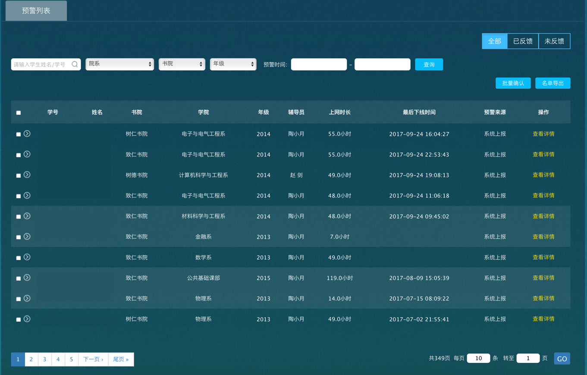

- 确认状态支持下拉选择原因，处理详情手动输入处理说明点击保存完成操作

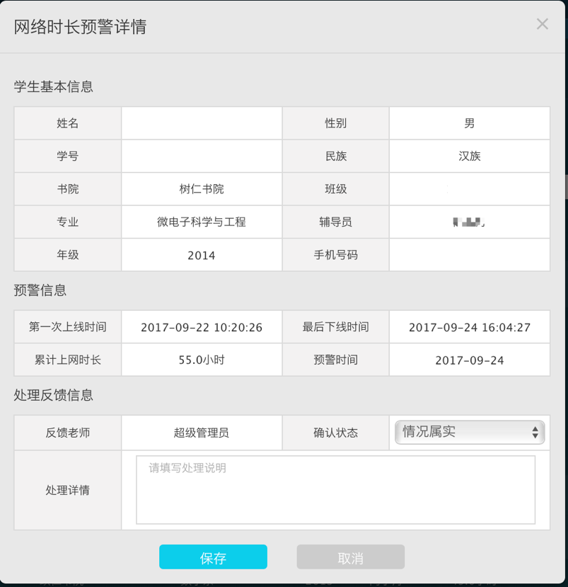

### 网络热力图
- 以网络热力图形式呈现学校上网情况分布
- 点击切换历史数据按键选择时间段所需时间段网络热力分布

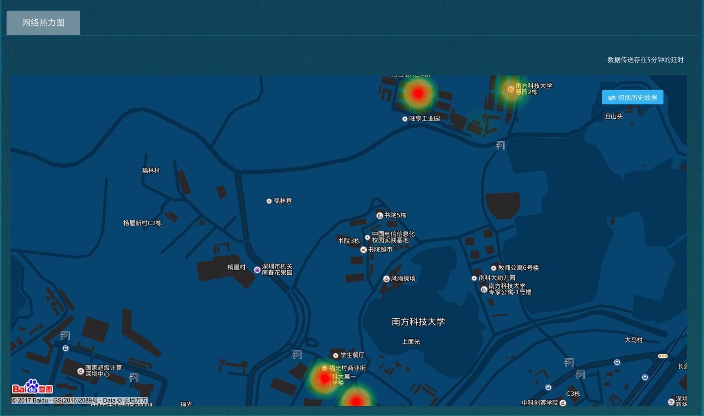

## 宿舍预警
### 预警报告
#### 时间范围选择
- 支持对近24小时、7天、30天、自定义时间维度选择，选择自定义选项左侧呈现时间范围选择框，点击确认后下方预警模块与选择的时间维度保持一致

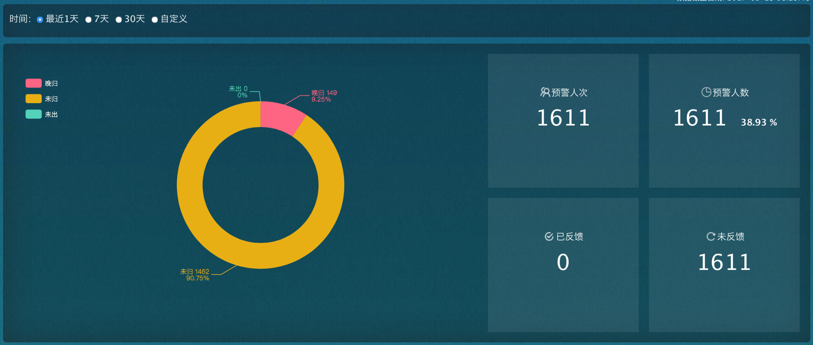

#### 预警占比
- 以饼图呈现晚归、未归、未出三类预警人数及占比预警总数
- 分别点击左侧晚归、未归、未出颜色方框，则点选后对应考勤类型占比及人数将不在饼图中展示

#### 预警概况
- 以标签形式呈现宿舍预警人次、预警人数、已反馈、未反馈数据

#### 预警人次
- 以柱状图形式呈现晚归、未归、未出三类预警对应日期人次
- 单击预警颜色方块图中对应不展示其数据
- 鼠标悬停对应日期柱状图显示晚归、未归、未出人次

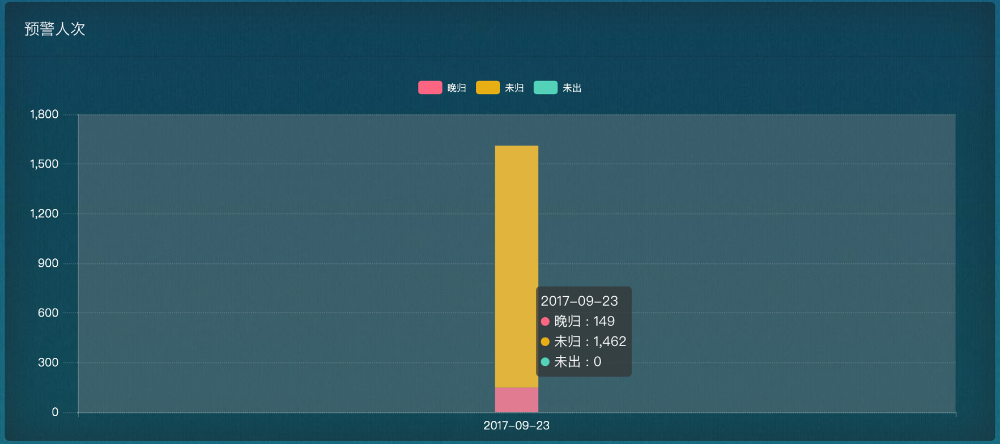

#### 晚归学生排行Top10
- 以排行榜形式呈现晚归学生排行，包括名次、学号、姓名、累计晚归次数、最长连续晚归天数
- 支持对全部、男、女晚归学生维度切换

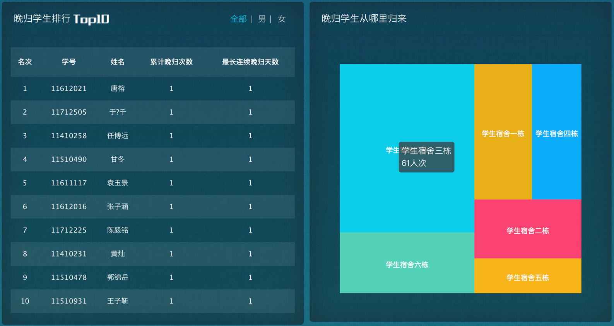

#### 晚归学生从哪里来
- 以矩阵数图形式呈现预警学生活动地点分布情况，矩形面积越大代表该地点活动人数越多
- 鼠标悬停任一区域显示该区域预警学生活动人数
- 双击任一区域对该区域放大显示详细地点信息

#### 夜不归宿排行Top10
- 以排行榜形式呈现未归学生排行，包括名次、学号、姓名、累计未归次数、最长连续未归天数
- 支持对全部、男、女晚归学生维度切换

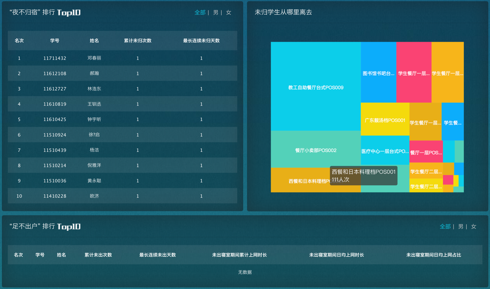

#### 未归学生从哪里离去
- 以矩阵数图形式呈现预警学生活动地点分布情况，矩形面积越大代表该地点活动人数越多
- 鼠标悬停任一区域显示该区域预警学生活动人数
- 双击任一区域对该区域放大显示详细地点信息

#### 足不出户排行Top10
- 以排行榜形式呈现未出学生排行，包括名次、学号、姓名、累计未出次数、最长连续未出天数、未出寝室累计上网时长、未出寝室期间日均上网时长、未出寝室期间日均上网占比

### 预警人员列表
#### 预警列表
- 支持按照反馈维度全部、已反馈、未反馈三类查看预警列表
- 支持输入学生姓名／学号点击查询搜索呈现对应学生网络预警信息
- 支持下拉筛选院系、书院、年级、宿舍预警类型，支持选择预警时间范围获取对应条件预警人员信息
- 支持对预警列表全选、单选，支持批量确认，预警名单导出
- 预警人员列表呈现学号、姓名、书院、宿舍、年级、辅导员、宿舍预警类型、最后行为、最后行为地点、最后行为时间、倒计时、操作信息
- 学号列点击学号旁展开按钮呈现该学生历史网络预警信息
- 操作列点击查看详情进入查看详情弹窗

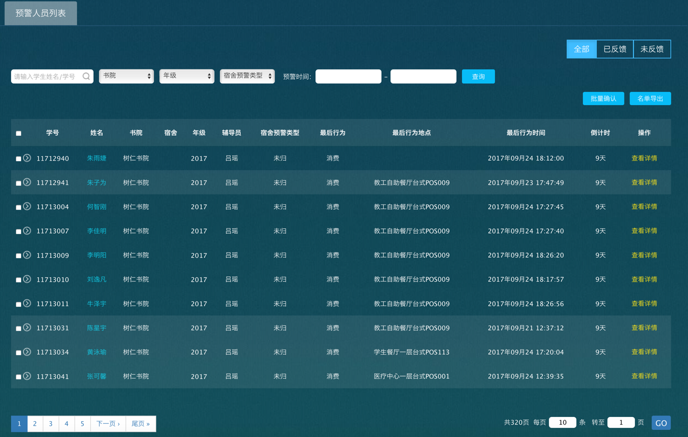

- 宿舍预警详情呈现学生基本信息（包括学生姓名、性别、学号、民族、书院、班级、专业、辅导员、年级、手机号）、预警信息（宿舍预警类型、最后行为、最后行为地点、最后行为时间、预警时间）、处理反馈信息（反馈老师、确认状态、处理详情）
- 确认状态支持下拉选择原因，处理详情手动输入处理说明点击保存完成操作

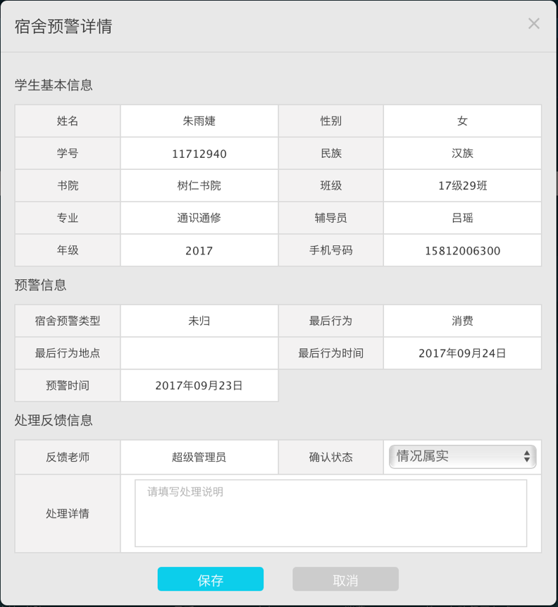

## 学生检索 & 学生画像
### 检索
#### 基础检索
- 支持输入学生姓名、学号、身份证号检索对应学生，呈现学生总人数
#### 高级检索
- 点击下拉框呈现高级检索条件，可下拉筛选年级、书院、层次、省份、民族、预警条件进行对应查询

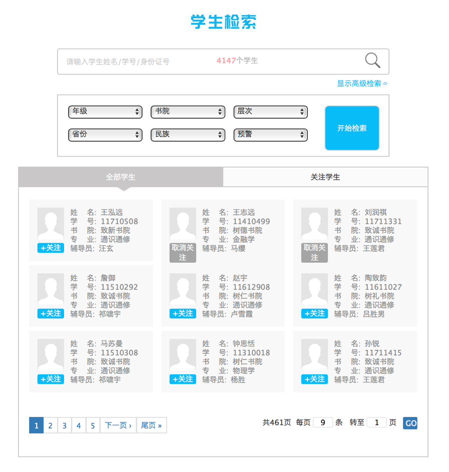

- 以全部学生、重点学生两个维度呈现

### 学生列表
#### 全部学生
- 呈现学生的头像（头像下方取消关注按钮支持取消关注操作）、姓名、学号、书院、专业、辅导员信息
#### 关注学生
- 呈现学生的头像（头像下方取消关注按钮支持取消关注操作）、姓名、学号、书院、专业、辅导员信息
- 所有应用中点击学生姓名均支持链接到学生画像页面
- 学生画像页面呈现学生基本信息、预警信息、消费信息

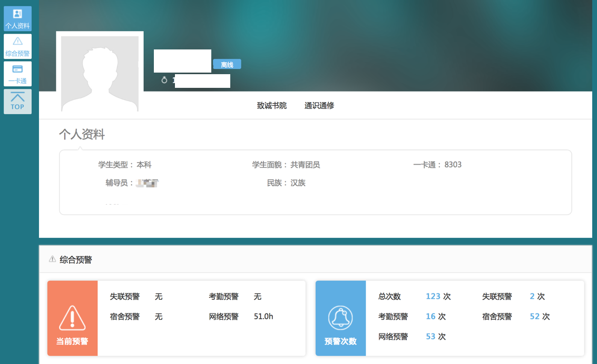
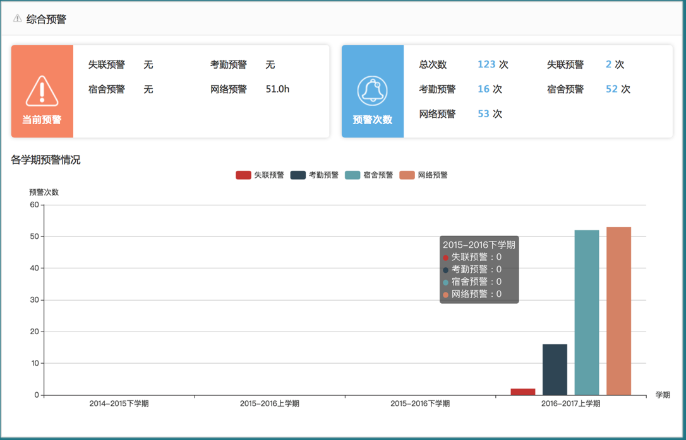

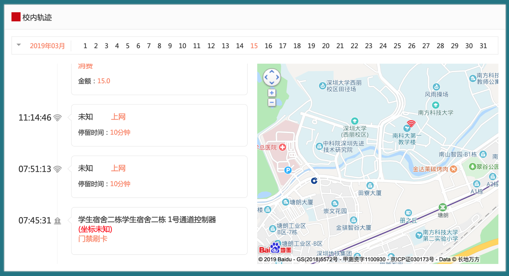

## 预警规则

```
a为某课程开始时间，b为某课程结束时间。
w=（a，b）之间第一次在教室内上网时间。
t=（a，b）之间最后一次教室内上网时间。
```

### 考勤预警（最新）
> 如果学生过去24小时有课，但在上课时间内，没有出现在教学楼区域，且同时在其他地方有刷卡消费或者门禁刷卡，或者其他区域的上网记录，则产生考勤（旷课、迟到、早退）预警。

1. **旷课** （a，b）无教室上网数据且（a+10，b-10）有其他地点行为数据。
2. **迟到** （ w，b）有教室上网数据且（a，w）有其他地点行为数据。
3. **早退** （a，t）有教室上网数据且（t，b）有其他地点行为数据。

### 宿舍预警
> 如果学生凌晨1点到5点，仍然有门禁的进入信息，则产生晚归、夜出夜归、夜出未归等预警；如果学生该回寝室的时间，即18:00-5:00，没有检测到门禁进入信息，则产生未归预警。如果0:00-24:00，该学生在宿舍区域，且没有检测到在其他区域的上网、消费、门禁信息，则产生未出预警。

1. **晚归** 1:00-5:00，仅有门禁进门数据
2. **夜出夜归** 1:00-5:00，有门禁数据，先出后进
3. **夜出未归** 01:00-05:00  最后门禁为出门数据&无进门数据 且 出门时间t-05:00 无宿舍上网数据
4. **未归** 05:00（前）-01:00 最后一条门禁数据出门 或 05:00（前）-01:00 无门禁进出数据且前一天有“未归”预警
5. **未出** 05:00（前）-01:00 无门禁进出数据且前一天最后一条门禁数据为进门 且 无非宿舍区行为（消费、上网）

### 失联预警
> 过去三天，如果没有检测到该学生在学校的任何数据（上网、消费、门禁），则产生失联预警
- 3天内没检测到该学生任何数据
